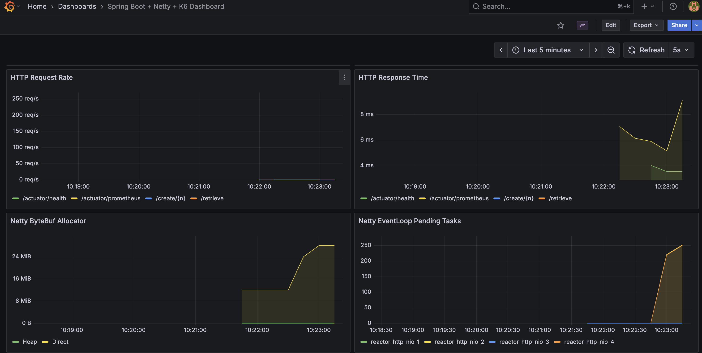

# Scala 3.x + Java 25 + Spring Boot 3.5.x + Netty + Metrics + Grafana + K6

### Build

```
sbt compile
```

### Run

Run the app
```
sbt run
```

Run with Podman Compose (Postgres)
```
podman-compose up
```

or use the script
```
./run-all.sh
```

Run with Kubernetes (Kind cluster)
```
./run-all-k8s.sh
```

### Endpoints

#### Application Endpoints - Podman Compose (port 8081)

**Data Management:**
- http://localhost:8081/create/100 - Creates 100 random entries in the database
- http://localhost:8081/create/1000 - Creates 1000 random entries in the database
- http://localhost:8081/retrieve - Retrieves all entries from the database
- http://localhost:8081/retrieve/1 - Retrieves a specific entry by ID

**Testing:**
- http://localhost:8081/slow/5 - Simulates a slow endpoint that sleeps for 5 seconds

**Health & Metrics:**
- http://localhost:8081/actuator/health - Main health check endpoint
- http://localhost:8081/actuator/health/readiness - Kubernetes readiness probe
- http://localhost:8081/actuator/health/liveness - Kubernetes liveness probe
- http://localhost:8081/actuator/prometheus - Prometheus metrics endpoint
- http://localhost:8081/actuator - All available actuator endpoints

#### Application Endpoints - Kubernetes (port 30081)

**Data Management:**
- http://localhost:30081/create/100 - Creates 100 random entries in the database
- http://localhost:30081/create/1000 - Creates 1000 random entries in the database
- http://localhost:30081/retrieve - Retrieves all entries from the database
- http://localhost:30081/retrieve/1 - Retrieves a specific entry by ID

**Testing:**
- http://localhost:30081/slow/5 - Simulates a slow endpoint that sleeps for 5 seconds

**Health & Metrics:**
- http://localhost:30081/actuator/health - Main health check endpoint
- http://localhost:30081/actuator/health/readiness - Kubernetes readiness probe
- http://localhost:30081/actuator/health/liveness - Kubernetes liveness probe
- http://localhost:30081/actuator/prometheus - Prometheus metrics endpoint
- http://localhost:30081/actuator - All available actuator endpoints
- http://localhost:8081/actuator/metrics - All available metrics

#### Monitoring Endpoints - Podman Compose

- http://localhost:3000 - Grafana home (admin/admin)
- http://localhost:3000/d/spring-netty-k6/spring-boot-2b-netty-2b-k6-dashboard?orgId=1&from=now-15m&to=now&timezone=browser&refresh=5s - Spring Boot + Netty + K6 Dashboard
- http://localhost:9090 - Prometheus metrics server
- http://localhost:9090/targets - Prometheus targets status
- http://localhost:9090/api/v1/label/__name__/values - List of all metric names

#### Monitoring Endpoints - Kubernetes

- http://localhost:30300 - Grafana home (admin/admin)
- http://localhost:30300/d/spring-netty-k6/spring-boot-2b-netty-2b-k6-dashboard?orgId=1&from=now-15m&to=now&timezone=browser&refresh=5s - Spring Boot + Netty + K6 Dashboard
- http://localhost:30090 - Prometheus metrics server
- http://localhost:30090/targets - Prometheus targets status

### Scripts

**Podman Compose:**
- `./run-all.sh` - Builds application and starts all containers with podman-compose
- `./stop-all.sh` - Stops all podman-compose containers
- `./insert-1k.sh` - Creates 1000 test entries in the database
- `./k6-retrieve-1k.sh` - Runs K6 stress test with 1000 virtual users
- `./k6-retrieve-nk.sh` - Runs K6 stress test with custom number of users (interactive)

**Kubernetes:**
- `./run-all-k8s.sh` - Creates Kind cluster and deploys all services
- `./shutdown-all.sh` - Destroys the Kind cluster completely

### Steps to Stress 

This test there is a volume of 1k calls but with a slow endpoint running in parallel, that's where we can see the healthchecker to get slow.

1. Run the app `./run-all.sh`.
2. Run `./insert-1k.sh` to insert 1000 test entries.
3. Run `./k6-retrieve-1k.sh` to perform a K6 stress test with 1000 virtual users.
4. Run `./call-slow.sh` must be in parallel with #3
5. Run `./call-health-checker.sh` couple of times. (parallel with #3 and #4)
5. Goto [Grafana](http://localhost:30300/d/spring-netty-k6/spring-boot-2b-netty-2b-k6-dashboard?orgId=1&from=now-15m&to=now&timezone=browser&refresh=5s)

### Grafana Dashboard

<br/>
<br/>
<br/>

Looking at the 3 Grafana dashboard images, the issue is NOT ulimit or hardware - it's a Netty EventLoop
thread pool sizing problem.

Here's why:

Evidence from the dashboards:

1. CPU Usage: Only 15% - You have 85% idle CPU, plenty of headroom
2. Memory: ~48 MiB - No memory pressure
3. Open File Descriptors: ~1.25 KiB - Well within limits, NOT a ulimit issue
4. JVM Threads: 16 → 19 - Only 3 additional threads created during load
5. Netty EventLoop Pending Tasks: 0 → 250+ - Work is queuing up massively
6. K6 Load: 1000 VUs @ 250 req/s - Significant concurrent load

The Real Problem:

Your Netty EventLoop has only 4 worker threads (reactor-http-nio-1 through 4) but you're hitting it with
1000 concurrent virtual users. The event loops cannot process requests fast enough, causing tasks to queue
up.

Why this happens:

- Netty defaults EventLoop threads to number of CPU cores (likely 4-8 on your Mac)
- With high concurrency (1K VUs), 4 threads cannot keep up
- CPU is idle because threads are likely blocked on I/O or network operations
- Tasks pile up in the EventLoop queue waiting for available threads

This is NOT:
- ❌ ulimit issue (file descriptors are fine)
- ❌ CPU/hardware issue (85% idle)
- ❌ macOS-specific issue

This IS:
- ✅ Netty worker thread pool is undersized for your concurrency level
- ✅ EventLoop threads might be blocking on synchronous operations
- ✅ Need to increase Netty EventLoop thread count or make handlers fully non-blocking

Solution: Increase Netty EventLoop threads in your NettyConfig or ensure all handlers are truly non-blocking/async.

Notes: Increasing the netty worker threads to 48 helped, see much less pending tasks. But even with a dedicated pool and 100% async, the health checker still block in the combination ofr stree(1k) + 1 slow(60s) request.