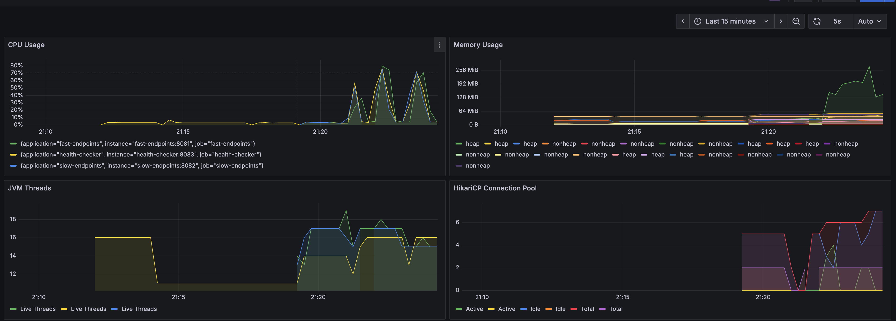
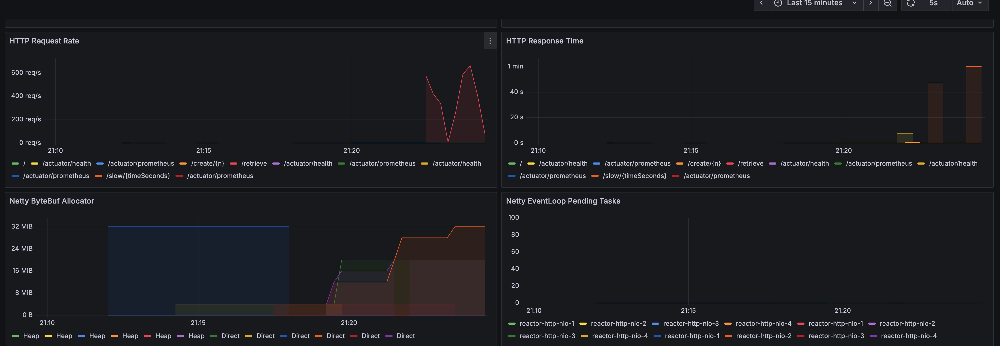
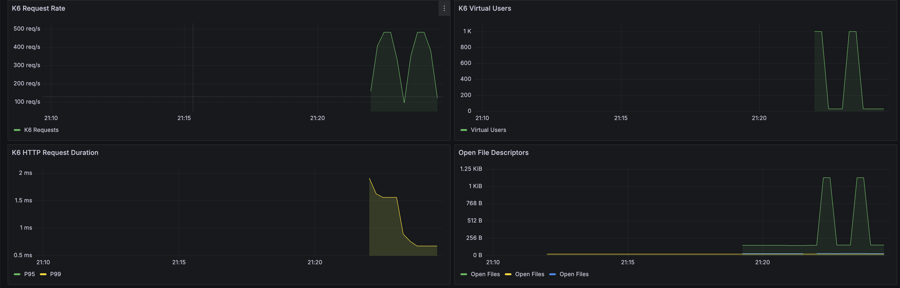

# Scala 3.x + Java 25 + Spring Boot 3.5.x + Netty Multi Workers + Metrics + Grafana + K6

Multi-Module SBT Structure
- core - Shared library with models, repository, service, metrics, config, and health components
- fast-endpoints - Port 8081, 64 Netty workers, MainController + DataEntryController
- slow-endpoints - Port 8082, 4 Netty workers, SlowController
- health-checker - Port 8083, 2 Netty workers, health endpoints only

### Build

```
sbt compile
```

### Run

Run the app
```
sbt run
```

Run with Podman Compose (Postgres)
```
podman-compose up
```

or use the script
```
./run-all.sh
```

Run with Kubernetes (Kind cluster)
```
./run-all-k8s.sh
```

### Endpoints

#### Application Endpoints - Podman Compose (port 8081)

**Data Management:**
- http://localhost:8081/create/100 - Creates 100 random entries in the database
- http://localhost:8081/create/1000 - Creates 1000 random entries in the database
- http://localhost:8081/retrieve - Retrieves all entries from the database
- http://localhost:8081/retrieve/1 - Retrieves a specific entry by ID

**Testing:**
- http://localhost:8081/slow/5 - Simulates a slow endpoint that sleeps for 5 seconds

**Health & Metrics:**
- http://localhost:8081/actuator/health - Main health check endpoint
- http://localhost:8081/actuator/health/readiness - Kubernetes readiness probe
- http://localhost:8081/actuator/health/liveness - Kubernetes liveness probe
- http://localhost:8081/actuator/prometheus - Prometheus metrics endpoint
- http://localhost:8081/actuator - All available actuator endpoints

#### Application Endpoints - Kubernetes (port 30081)

**Data Management:**
- http://localhost:30081/create/100 - Creates 100 random entries in the database
- http://localhost:30081/create/1000 - Creates 1000 random entries in the database
- http://localhost:30081/retrieve - Retrieves all entries from the database
- http://localhost:30081/retrieve/1 - Retrieves a specific entry by ID

**Testing:**
- http://localhost:30081/slow/5 - Simulates a slow endpoint that sleeps for 5 seconds

**Health & Metrics:**
- http://localhost:30081/actuator/health - Main health check endpoint
- http://localhost:30081/actuator/health/readiness - Kubernetes readiness probe
- http://localhost:30081/actuator/health/liveness - Kubernetes liveness probe
- http://localhost:30081/actuator/prometheus - Prometheus metrics endpoint
- http://localhost:30081/actuator - All available actuator endpoints
- http://localhost:8081/actuator/metrics - All available metrics

#### Monitoring Endpoints - Podman Compose

- http://localhost:3000 - Grafana home (admin/admin)
- http://localhost:3000/d/spring-netty-k6/spring-boot-2b-netty-2b-k6-dashboard?orgId=1&from=now-15m&to=now&timezone=browser&refresh=5s - Spring Boot + Netty + K6 Dashboard
- http://localhost:9090 - Prometheus metrics server
- http://localhost:9090/targets - Prometheus targets status
- http://localhost:9090/api/v1/label/__name__/values - List of all metric names

#### Monitoring Endpoints - Kubernetes

- http://localhost:30300 - Grafana home (admin/admin)
- http://localhost:30300/d/spring-netty-k6/spring-boot-2b-netty-2b-k6-dashboard?orgId=1&from=now-15m&to=now&timezone=browser&refresh=5s - Spring Boot + Netty + K6 Dashboard
- http://localhost:30090 - Prometheus metrics server
- http://localhost:30090/targets - Prometheus targets status

### Scripts

**Podman Compose:**
- `./run-all.sh` - Builds application and starts all containers with podman-compose
- `./stop-all.sh` - Stops all podman-compose containers
- `./insert-1k.sh` - Creates 1000 test entries in the database
- `./k6-retrieve-1k.sh` - Runs K6 stress test with 1000 virtual users
- `./k6-retrieve-nk.sh` - Runs K6 stress test with custom number of users (interactive)

**Kubernetes:**
- `./run-all-k8s.sh` - Creates Kind cluster and deploys all services
- `./shutdown-all.sh` - Destroys the Kind cluster completely

### Steps to Stress 

This test there is a volume of 1k calls but with a slow endpoint running in parallel, that's where we can see the healthchecker to get slow.

1. Run the app `./run-all.sh`.
2. Run `./insert-1k.sh` to insert 1000 test entries.
3. Run `./k6-retrieve-1k.sh` to perform a K6 stress test with 1000 virtual users.
4. Run `./call-slow.sh` must be in parallel with #3
5. Run `./call-health-checker.sh` couple of times. (parallel with #3 and #4)
5. Goto [Grafana](http://localhost:30300/d/spring-netty-k6/spring-boot-2b-netty-2b-k6-dashboard?orgId=1&from=now-15m&to=now&timezone=browser&refresh=5s)

### Grafana Dashboard

<br/>
<br/>
<br/>

No Performance issue.
Fast has : Netty Worker Threads = 48
Slow has : Netty Worker Threads = 4
Health Checker has : Netty Worker Threads = 2

## Some Important Notes

### Ibcrease Hikari Pool Size to match Netty IO Workers threads

By default, HikariCP uses a maximum pool size of 10 connections. 
With a high number of Netty(48 in the file: NettyConfig.scala) event loop threads, this can lead to contention and blocking if many requests.
```
spring.datasource.hikari.maximum-pool-size=48
spring.datasource.hikari.minimum-idle=24
```

### Exploring other options

## Virtual Threads

Virtual threads solve the blocking problem, but they work with the thread-per-request model (Spring MVC +
Tomcat), not the event-loop model (WebFlux + Netty). Switch away from WebFlux/Netty entirely.
Virtual threads are a game-changer for blocking I/O workloads. They give you the simplicity of blocking code
with near-reactive performance.
```
spring.threads.virtual.enabled=true
```

How it would work:
- Spring Boot 3.2+ with spring.threads.virtual.enabled=true
- Use Spring MVC (not WebFlux) with Tomcat
- Each request gets a virtual thread that can block cheaply
- Thread.sleep(60) or blocking JDBC calls occupy a virtual thread (cheap)
- Millions of virtual threads possible, so 1000 concurrent requests + slow endpoints = no problem
- Health checks get their own virtual thread, no starvation

## Circuit breaker pattern
Protect the system from overload:
  - Fail fast when overloaded instead of queueing requests
  - Return 503 Service Unavailable immediately when EventLoops are saturated
  - Resilience4j or Spring Cloud Circuit Breaker

## Explicit Timeouts

Request timeout + backpressure:
- Set aggressive timeouts on incoming requests
- Reject requests with 429 Too Many Requests when queue depth exceeds threshold
- Don't let slow requests accumulate

## Reverse Proxy

Reverse proxy with request routing:
  - NGINX or Envoy in front
  - Route /slow/* to a separate instance with different thread pool configuration
  - Route health checks to a separate endpoint that skips database checks under load

## Does WebFlux auto-wrap code in Mono/Flux?

Yes, but it's mostly useless if your code is blocking.

Here's what actually happens:
```
  @GetMapping("/data")
  def getData(): String = {
    val result = jdbcTemplate.query(...) // BLOCKS EventLoop thread here!
    result // Spring wraps this in Mono.just(result) for you
  }
```

What Spring does:
- Wraps your return value in Mono.just(yourValue) automatically
- The HTTP response is written reactively

What Spring does NOT do:
- Make your blocking code non-blocking
- Execute your method on a different thread pool
- Magically convert JDBC to R2DBC

The execution still happens on the EventLoop thread. The wrapping is just for the return value.

What blocks EventLoop threads:
  - Thread.sleep()
  - JDBC calls (all standard JDBC drivers are blocking)
  - Blocking HTTP clients (RestTemplate, Apache HttpClient without async)
  - File I/O without async APIs
  - Mono.block(), CompletableFuture.get(), Future.get()
  - Synchronized blocks or lock contention
  - CPU-intensive work (occupies thread, not I/O blocking but same effect)

## Comparison: Netty vs NodeJS

-----------------------------------------------------------------------------------------
| Aspect              | Node.js                     | Netty                             |
|---------------------|-----------------------------|-----------------------------------|
| Event loops         | 1 (single-threaded JS)      | N (configurable, e.g., 48)        |
| Blocking impact     | Freezes entire server       | Freezes 1/N of capacity           |
| Ecosystem           | Async by default            | Mixed (must choose reactive libs) |
| Learning curve      | Easier (callbacks/promises) | Harder (Reactor, WebFlux)         |
| Performance ceiling | Lower (single loop)         | Higher (multi-loop)               |
-----------------------------------------------------------------------------------------

### Related POCs

* https://github.com/diegopacheco/scala-playground/tree/master/scala-3.7-spring-boot-3.5-virtual-metrics-grafana-k6
* https://github.com/diegopacheco/java-pocs/tree/master/pocs/java-21-spring-boot-3-async
* https://github.com/diegopacheco/java-pocs/tree/master/pocs/java-21-spring-boot-3-async-virtual-threads
* https://github.com/diegopacheco/java-pocs/tree/master/pocs/java-21-spring-boot-3-async-tomcat
* https://github.com/diegopacheco/java-pocs/tree/master/pocs/spring-boot-3x-actuator-health-checker-experiments
* https://github.com/diegopacheco/java-pocs/tree/master/pocs/spring-boot-3x-actuator-get-internal-metric