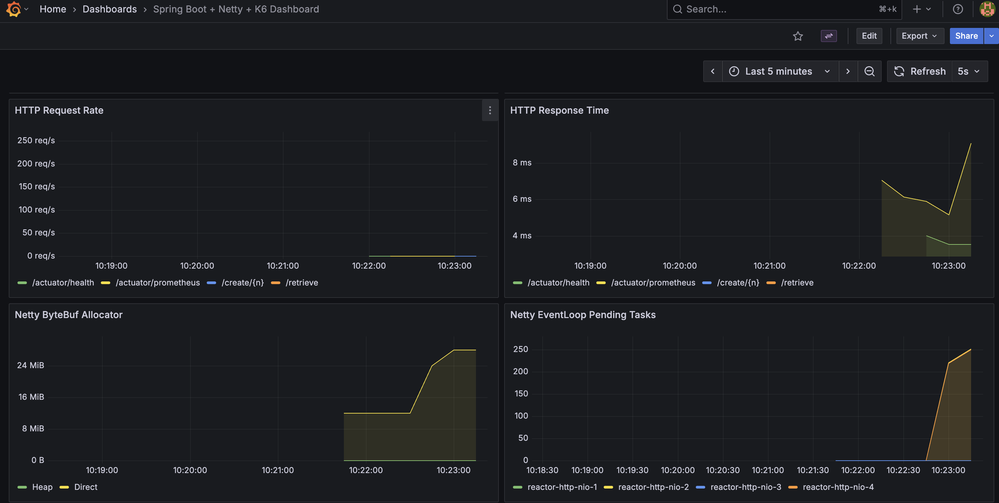
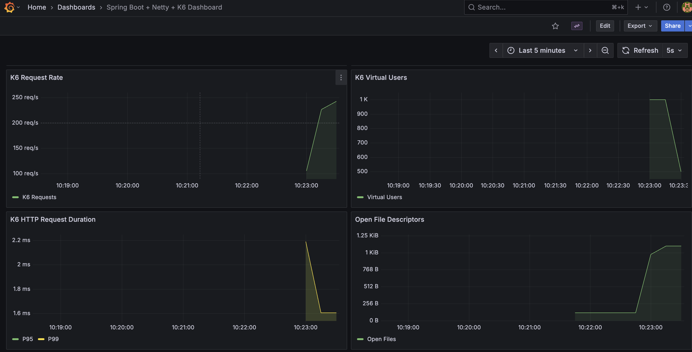

# Scala 3.x + Java 25 + Spring Boot 3.5.x + Netty Multi Workers + Metrics + Grafana + K6

Multi-Module SBT Structure
- core - Shared library with models, repository, service, metrics, config, and health components
- fast-endpoints - Port 8081, 64 Netty workers, MainController + DataEntryController
- slow-endpoints - Port 8082, 4 Netty workers, SlowController
- health-checker - Port 8083, 2 Netty workers, health endpoints only

### Build

```
sbt compile
```

### Run

Run the app
```
sbt run
```

Run with Podman Compose (Postgres)
```
podman-compose up
```

or use the script
```
./run-all.sh
```

Run with Kubernetes (Kind cluster)
```
./run-all-k8s.sh
```

### Endpoints

#### Application Endpoints - Podman Compose (port 8081)

**Data Management:**
- http://localhost:8081/create/100 - Creates 100 random entries in the database
- http://localhost:8081/create/1000 - Creates 1000 random entries in the database
- http://localhost:8081/retrieve - Retrieves all entries from the database
- http://localhost:8081/retrieve/1 - Retrieves a specific entry by ID

**Testing:**
- http://localhost:8081/slow/5 - Simulates a slow endpoint that sleeps for 5 seconds

**Health & Metrics:**
- http://localhost:8081/actuator/health - Main health check endpoint
- http://localhost:8081/actuator/health/readiness - Kubernetes readiness probe
- http://localhost:8081/actuator/health/liveness - Kubernetes liveness probe
- http://localhost:8081/actuator/prometheus - Prometheus metrics endpoint
- http://localhost:8081/actuator - All available actuator endpoints

#### Application Endpoints - Kubernetes (port 30081)

**Data Management:**
- http://localhost:30081/create/100 - Creates 100 random entries in the database
- http://localhost:30081/create/1000 - Creates 1000 random entries in the database
- http://localhost:30081/retrieve - Retrieves all entries from the database
- http://localhost:30081/retrieve/1 - Retrieves a specific entry by ID

**Testing:**
- http://localhost:30081/slow/5 - Simulates a slow endpoint that sleeps for 5 seconds

**Health & Metrics:**
- http://localhost:30081/actuator/health - Main health check endpoint
- http://localhost:30081/actuator/health/readiness - Kubernetes readiness probe
- http://localhost:30081/actuator/health/liveness - Kubernetes liveness probe
- http://localhost:30081/actuator/prometheus - Prometheus metrics endpoint
- http://localhost:30081/actuator - All available actuator endpoints
- http://localhost:8081/actuator/metrics - All available metrics

#### Monitoring Endpoints - Podman Compose

- http://localhost:3000 - Grafana home (admin/admin)
- http://localhost:3000/d/spring-netty-k6/spring-boot-2b-netty-2b-k6-dashboard?orgId=1&from=now-15m&to=now&timezone=browser&refresh=5s - Spring Boot + Netty + K6 Dashboard
- http://localhost:9090 - Prometheus metrics server
- http://localhost:9090/targets - Prometheus targets status
- http://localhost:9090/api/v1/label/__name__/values - List of all metric names

#### Monitoring Endpoints - Kubernetes

- http://localhost:30300 - Grafana home (admin/admin)
- http://localhost:30300/d/spring-netty-k6/spring-boot-2b-netty-2b-k6-dashboard?orgId=1&from=now-15m&to=now&timezone=browser&refresh=5s - Spring Boot + Netty + K6 Dashboard
- http://localhost:30090 - Prometheus metrics server
- http://localhost:30090/targets - Prometheus targets status

### Scripts

**Podman Compose:**
- `./run-all.sh` - Builds application and starts all containers with podman-compose
- `./stop-all.sh` - Stops all podman-compose containers
- `./insert-1k.sh` - Creates 1000 test entries in the database
- `./k6-retrieve-1k.sh` - Runs K6 stress test with 1000 virtual users
- `./k6-retrieve-nk.sh` - Runs K6 stress test with custom number of users (interactive)

**Kubernetes:**
- `./run-all-k8s.sh` - Creates Kind cluster and deploys all services
- `./shutdown-all.sh` - Destroys the Kind cluster completely

### Steps to Stress 

This test there is a volume of 1k calls but with a slow endpoint running in parallel, that's where we can see the healthchecker to get slow.

1. Run the app `./run-all.sh`.
2. Run `./insert-1k.sh` to insert 1000 test entries.
3. Run `./k6-retrieve-1k.sh` to perform a K6 stress test with 1000 virtual users.
4. Run `./call-slow.sh` must be in parallel with #3
5. Run `./call-health-checker.sh` couple of times. (parallel with #3 and #4)
5. Goto [Grafana](http://localhost:30300/d/spring-netty-k6/spring-boot-2b-netty-2b-k6-dashboard?orgId=1&from=now-15m&to=now&timezone=browser&refresh=5s)

### Grafana Dashboard

<br/>
<br/>
<br/>

Looking at the 3 Grafana dashboard images, the issue is NOT ulimit or hardware - it's a Netty EventLoop
thread pool sizing problem.

Here's why:

Evidence from the dashboards:

1. CPU Usage: Only 15% - You have 85% idle CPU, plenty of headroom
2. Memory: ~48 MiB - No memory pressure
3. Open File Descriptors: ~1.25 KiB - Well within limits, NOT a ulimit issue
4. JVM Threads: 16 → 19 - Only 3 additional threads created during load
5. Netty EventLoop Pending Tasks: 0 → 250+ - Work is queuing up massively
6. K6 Load: 1000 VUs @ 250 req/s - Significant concurrent load

The Real Problem:

Your Netty EventLoop has only 4 worker threads (reactor-http-nio-1 through 4) but you're hitting it with
1000 concurrent virtual users. The event loops cannot process requests fast enough, causing tasks to queue
up.

Why this happens:

- Netty defaults EventLoop threads to number of CPU cores (likely 4-8 on your Mac)
- With high concurrency (1K VUs), 4 threads cannot keep up
- CPU is idle because threads are likely blocked on I/O or network operations
- Tasks pile up in the EventLoop queue waiting for available threads

This is NOT:
- ❌ ulimit issue (file descriptors are fine)
- ❌ CPU/hardware issue (85% idle)
- ❌ macOS-specific issue

This IS:
- ✅ Netty worker thread pool is undersized for your concurrency level
- ✅ EventLoop threads might be blocking on synchronous operations
- ✅ Need to increase Netty EventLoop thread count or make handlers fully non-blocking

Solution: Increase Netty EventLoop threads in your NettyConfig or ensure all handlers are truly non-blocking/async.

Notes: Increasing the netty worker threads to 48 helped, see much less pending tasks. But even with a dedicated pool and 100% async, the health checker still block in the combination ofr stree(1k) + 1 slow(60s) request.

When running all this 3 in parallel:
- ./k6-retrieve-1k.sh
- ./call-slow.sh
- ./call-health-checker.sh (after 3-4 calls)

```bash
❯ ./call-health-checker.sh
HTTP/1.1 200 OK
Content-Type: application/vnd.spring-boot.actuator.v3+json
Content-Length: 416

{"status":"UP","components":{"custom":{"status":"UP","details":{"status":"healthy","service":"running"}},"db":{"status":"UP","details":{"database":"PostgreSQL","validationQuery":"isValid()"}},"diskSpace":{"status":"UP","details":{"total":53082042368,"free":27377373184,"threshold":10485760,"path":"/app/.","exists":true}},"ping":{"status":"UP"},"ssl":{"status":"UP","details":{"validChains":[],"invalidChains":[]}}}}
real	0m0.072s
user	0m0.004s
sys	0m0.004s

❯ ./call-health-checker.sh
HTTP/1.1 200 OK
Content-Type: application/vnd.spring-boot.actuator.v3+json
Content-Length: 416

{"status":"UP","components":{"custom":{"status":"UP","details":{"status":"healthy","service":"running"}},"db":{"status":"UP","details":{"database":"PostgreSQL","validationQuery":"isValid()"}},"diskSpace":{"status":"UP","details":{"total":53082042368,"free":27376353280,"threshold":10485760,"path":"/app/.","exists":true}},"ping":{"status":"UP"},"ssl":{"status":"UP","details":{"validChains":[],"invalidChains":[]}}}}
real	0m52.071s
user	0m0.004s
sys	0m0.005s
```

Why?

The problem is NOT the health checker pool - it's that health check HTTP requests still need a Netty
EventLoop thread to be accepted and processed, and all 48 threads are busy/blocked.

Here's what's happening:

The Real Bottleneck:

1. Your /slow/60 endpoint is blocking - It likely sleeps/blocks a Netty EventLoop thread for 60 seconds
2. 1000 concurrent K6 users are hammering the server
3. All 48 EventLoop threads get occupied handling these requests
4. When health check request arrives, it waits in the TCP backlog queue for an available EventLoop thread
5. After 52 seconds, a thread finally becomes free and processes the health check

Why @Async didn't help:

The @Async pool only helps with the health check logic, but:
- The HTTP request must first be accepted by a Netty EventLoop thread
- The checkHealthAsync().get() call blocks that EventLoop thread waiting for the result
- You're still consuming a Netty EventLoop thread for the entire health check request

The actual issue is /slow/60 - if it's doing this:
Thread.sleep(60000)  // BLOCKS EventLoop thread!

This ties up EventLoop threads, starving all other requests including health checks.

Solutions:

1. Make /slow truly async - Use Reactor's Mono.delay() instead of Thread.sleep()
2. Separate health check port - Run management endpoints on a different port with separate EventLoop
3. Don't test with blocking slow endpoints - They kill Netty performance

Netty EventLoop Architecture:

1. EventLoops are assigned per TCP connection, not per endpoint/URL
- When a client connects to port 8081, the connection gets assigned to one EventLoop thread
- That EventLoop handles ALL requests on that connection regardless of the URL path
- Routing to /actuator/health vs /slow happens AFTER the EventLoop accepts the request
2. One EventLoop pool per server port
- Port 8081 has one EventLoop group (your 48 threads)
- All connections to that port share those 48 threads
- You cannot partition them by endpoint
3. HTTP Keep-Alive makes it impossible
- Same TCP connection can send requests to /slow, then /actuator/health
- The EventLoop is bound to the connection, not the request

Options:

Option 1: Separate management port (RECOMMENDED)
```
management.server.port=9090
server.port=8081
```
- Health checks on port 9090 with separate EventLoop pool
- App traffic on port 8081
- Complete isolation

Option 2: Make /slow non-blocking (BEST PRACTICE)
```
Mono.delay(Duration.ofSeconds(60)).map(_ => "done")
```
- Doesn't tie up EventLoop threads
- Netty can handle 10,000+ concurrent slow requests

Option 3: Offload /slow to separate thread pool
```
@Async("slowRequestExecutor")
```
- But still requires EventLoop thread to accept request
- Not as good as Option 2

Even doing option #3 still the same issue of the "health checker" being stuck and taking a long time.

### Stack Diagrams

Podman Compose Stack(run-all.sh):
```
┌─────────────────────────────────────────────────────────────┐
│ K6 Load Generator (1000 VUs)                                │
└──────────────────┬──────────────────────────────────────────┘
                   │ HTTP requests
                   ▼
┌─────────────────────────────────────────────────────────────┐
│ Docker Network (bridge)                                     │
└──────────────────┬──────────────────────────────────────────┘
                   │
                   ▼
        ┌──────────────────────┐
        │  Port 8081 (mapped)  │
        └──────────┬───────────┘
                   │
        ┌──────────▼────────────────────────────────────────┐
        │  Scala App Container                              │
        │  ┌─────────────────────────────────────────────┐  │
        │  │ Netty HTTP Server (port 8081)               │  │
        │  │  ┌───────────────────────────────────────┐  │  │
        │  │  │ Boss EventLoopGroup (accept conns)    │  │  │
        │  │  │   - 1 thread                          │  │  │
        │  │  └─────────────┬─────────────────────────┘  │  │
        │  │                │                            │  │
        │  │  ┌─────────────▼─────────────────────────┐  │  │
        │  │  │ Worker EventLoopGroup (48 threads)    │  │  │
        │  │  │  - reactor-http-nio-1                 │  │  │
        │  │  │  - reactor-http-nio-2                 │  │  │
        │  │  │  - ...                                │  │  │
        │  │  │  - reactor-http-nio-48                │  │  │
        │  │  │                                       │  │  │
        │  │  │  ⚠️  BOTTLENECK: All threads blocked  │  │  │
        │  │  │     by /slow + 1K concurrent reqs     │  │  │
        │  │  └─────────────┬─────────────────────────┘  │  │
        │  └────────────────┼────────────────────────────┘  │
        │                   │                               │
        │  ┌────────────────▼────────────────────────────┐  │
        │  │ Spring Boot WebFlux Router                  │  │
        │  │  - /create/{n}                              │  │
        │  │  - /retrieve                                │  │
        │  │  - /slow/{seconds}  [BLOCKS THREAD]         │  │
        │  │  - /actuator/health                         │  │
        │  └────────────────┬────────────────────────────┘  │
        │                   │                               │
        │  ┌────────────────▼────────────────────────────┐  │
        │  │ Controller Layer (Scala)                    │  │
        │  │  - @RestController                          │  │
        │  │  - @GetMapping                              │  │
        │  └────────────────┬────────────────────────────┘  │
        │                   │                               │
        │  ┌────────────────▼────────────────────────────┐  │
        │  │ Health Check Components                     │  │
        │  │  - CustomHealthIndicator                    │  │
        │  │  - @Async pool (doesn't help!)              │  │
        │  │  - checkHealthAsync().get() ⚠️ BLOCKS       │  │
        │  └────────────────┬────────────────────────────┘  │
        │                   │                               │
        │  ┌────────────────▼────────────────────────────┐  │
        │  │ Database Access (JPA/JDBC)                  │  │
        │  └────────────────┬────────────────────────────┘  │
        └───────────────────┼───────────────────────────────┘
                   │
                   ▼
        ┌─────────────────────────────────┐
        │ PostgreSQL Container            │
        │   - Port 5432                   │
        └─────────────────────────────────┘

        ┌─────────────────────────────────┐
        │ Prometheus Container            │
        │   - Scrapes :8081/actuator/...  │
        │   - Port 9090                   │
        └─────────────────────────────────┘
                   │
                   ▼
        ┌─────────────────────────────────┐
        │ Grafana Container               │
        │   - Queries Prometheus          │
        │   - Port 3000                   │
        └─────────────────────────────────┘

```

Kubernetes (Kind) Stack(run-all-k8s.sh):
```
┌─────────────────────────────────────────────────────────────┐
│ K6 (running on host machine)                                │
└──────────────────┬──────────────────────────────────────────┘
                   │ HTTP to localhost:30081
                   ▼
┌─────────────────────────────────────────────────────────────┐
│ Host Machine (macOS)                                        │
│   localhost:30081 → NodePort forwarding                     │
└──────────────────┬──────────────────────────────────────────┘
                   │
                   ▼
┌─────────────────────────────────────────────────────────────┐
│ Kind Cluster (Docker/Podman container)                      │
│                                                             │
│  ┌──────────────────────────────────────────────────────┐   │
│  │ NodePort Service (scala-app-service)                 │   │
│  │   - type: NodePort                                   │   │
│  │   - port: 8081                                       │   │
│  │   - nodePort: 30081                                  │   │
│  │   - selector: app=scala-app                          │   │
│  └────────────────┬─────────────────────────────────────┘   │
│                   │                                         │
│                   │ kube-proxy iptables routing             │
│                   ▼                                         │
│  ┌──────────────────────────────────────────────────────┐   │
│  │ Pod: scala-app-xxxxxx                                │   │
│  │                                                      │   │
│  │  ┌─────────────────────────────────────────────────┐ │   │
│  │  │ Container: scala-app                            │ │   │
│  │  │  ┌───────────────────────────────────────────┐  │ │   │
│  │  │  │ Netty HTTP Server (container port 8081)   │  │ │   │
│  │  │  │  ┌─────────────────────────────────────┐  │  │ │   │
│  │  │  │  │ Boss EventLoopGroup (1 thread)      │  │  │ │   │
│  │  │  │  └──────────┬──────────────────────────┘  │  │ │   │
│  │  │  │             │                             │  │ │   │
│  │  │  │  ┌──────────▼──────────────────────────┐  │  │ │   │
│  │  │  │  │ Worker EventLoopGroup (48 threads)  │  │  │ │   │
│  │  │  │  │   reactor-http-nio-1 to 48          │  │  │ │   │
│  │  │  │  │                                     │  │  │ │   │
│  │  │  │  │   ⚠️  BOTTLENECK HERE               │  │  │ │   │
│  │  │  │  └──────────┬──────────────────────────┘  │  │ │   │
│  │  │  └─────────────┼─────────────────────────────┘  │ │   │
│  │  │                │                                │ │   │
│  │  │  ┌─────────────▼─────────────────────────────┐  │ │   │
│  │  │  │ Spring Boot Application                   │  │ │   │
│  │  │  │   - Controllers                           │  │ │   │
│  │  │  │   - Health Indicators                     │  │ │   │
│  │  │  │   - /slow [BLOCKS THREAD]                 │  │ │   │
│  │  │  └─────────────┬─────────────────────────────┘  │ │   │
│  │  └────────────────┼────────────────────────────────┘ │   │
│  │                   │                                  │   │
│  │  ┌────────────────▼────────────────────────────────┐ │   │
│  │  │ DB Connection to postgres-service:5432          │ │   │
│  │  └────────────────┬────────────────────────────────┘ │   │
│  └───────────────────┼──────────────────────────────────┘   │
│                      │                                      │
│  ┌───────────────────▼──────────────────────────────────┐   │
│  │ Service: postgres-service (ClusterIP)                │   │
│  │   - port: 5432                                       │   │
│  └────────────────┬─────────────────────────────────────┘   │
│                   │                                         │
│  ┌────────────────▼─────────────────────────────────────┐   │
│  │ Pod: postgres-xxxxxx                                 │   │
│  │   - PostgreSQL database                              │   │
│  └──────────────────────────────────────────────────────┘   │
│                                                             │
│  ┌──────────────────────────────────────────────────────┐   │
│  │ Service: prometheus-service (NodePort 30090)         │   │
│  └────────────────┬─────────────────────────────────────┘   │
│                   │                                         │
│  ┌────────────────▼─────────────────────────────────────┐   │
│  │ Pod: prometheus-xxxxxx                               │   │
│  │   - Scrapes scala-app-service:8081/actuator/...      │   │
│  │   - RBAC: ServiceAccount, ClusterRole, Binding       │   │
│  └──────────────────────────────────────────────────────┘   │
│                   │                                         │
│  ┌────────────────▼─────────────────────────────────────┐   │
│  │ Service: grafana-service (NodePort 30300)            │   │
│  └────────────────┬─────────────────────────────────────┘   │
│                   │                                         │
│  ┌────────────────▼─────────────────────────────────────┐   │
│  │ Pod: grafana-xxxxxx                                  │   │
│  │   - Queries prometheus-service:9090                  │   │
│  │   - Dashboard provisioning via ConfigMap             │   │
│  └──────────────────────────────────────────────────────┘   │
└─────────────────────────────────────────────────────────────┘
```

### Netty vs Tomcat

Tomcat could do better in this specific scenario. Here's why:

Tomcat (Thread-per-Request Model):
- Default thread pool: ~200 threads
- Each request gets its own dedicated thread
- Thread.sleep(60000) blocks ONE thread, not the entire server
- With 1000 VUs + 1 slow request:
- First 200 requests get threads immediately
- Remaining 800 queue up and wait
- Health checks can still get a thread (unless all 200 are blocked)
- Graceful degradation under load

Netty (Event Loop Model):
- 48 EventLoop threads (in your config)
- EventLoops handle ALL I/O operations
- Thread.sleep(60000) blocks an EventLoop thread - catastrophic
- With 1000 VUs + 1 slow request:
- All 48 EventLoop threads get blocked quickly
- Everything stops - no new requests can be accepted
- Health checks wait 52+ seconds for a free EventLoop
- Complete starvation

## Some Important Notes

### Ibcrease Hikari Pool Size to match Netty IO Workers threads

By default, HikariCP uses a maximum pool size of 10 connections. 
With a high number of Netty(48 in the file: NettyConfig.scala) event loop threads, this can lead to contention and blocking if many requests.
```
spring.datasource.hikari.maximum-pool-size=48
spring.datasource.hikari.minimum-idle=24
```

### Exploring other options

## Virtual Threads

Virtual threads solve the blocking problem, but they work with the thread-per-request model (Spring MVC +
Tomcat), not the event-loop model (WebFlux + Netty). Switch away from WebFlux/Netty entirely.
Virtual threads are a game-changer for blocking I/O workloads. They give you the simplicity of blocking code
with near-reactive performance.
```
spring.threads.virtual.enabled=true
```

How it would work:
- Spring Boot 3.2+ with spring.threads.virtual.enabled=true
- Use Spring MVC (not WebFlux) with Tomcat
- Each request gets a virtual thread that can block cheaply
- Thread.sleep(60) or blocking JDBC calls occupy a virtual thread (cheap)
- Millions of virtual threads possible, so 1000 concurrent requests + slow endpoints = no problem
- Health checks get their own virtual thread, no starvation

## Circuit breaker pattern
Protect the system from overload:
  - Fail fast when overloaded instead of queueing requests
  - Return 503 Service Unavailable immediately when EventLoops are saturated
  - Resilience4j or Spring Cloud Circuit Breaker

## Explicit Timeouts

Request timeout + backpressure:
- Set aggressive timeouts on incoming requests
- Reject requests with 429 Too Many Requests when queue depth exceeds threshold
- Don't let slow requests accumulate

## Reverse Proxy

Reverse proxy with request routing:
  - NGINX or Envoy in front
  - Route /slow/* to a separate instance with different thread pool configuration
  - Route health checks to a separate endpoint that skips database checks under load

## Does WebFlux auto-wrap code in Mono/Flux?

Yes, but it's mostly useless if your code is blocking.

Here's what actually happens:
```
  @GetMapping("/data")
  def getData(): String = {
    val result = jdbcTemplate.query(...) // BLOCKS EventLoop thread here!
    result // Spring wraps this in Mono.just(result) for you
  }
```

What Spring does:
- Wraps your return value in Mono.just(yourValue) automatically
- The HTTP response is written reactively

What Spring does NOT do:
- Make your blocking code non-blocking
- Execute your method on a different thread pool
- Magically convert JDBC to R2DBC

The execution still happens on the EventLoop thread. The wrapping is just for the return value.

What blocks EventLoop threads:
  - Thread.sleep()
  - JDBC calls (all standard JDBC drivers are blocking)
  - Blocking HTTP clients (RestTemplate, Apache HttpClient without async)
  - File I/O without async APIs
  - Mono.block(), CompletableFuture.get(), Future.get()
  - Synchronized blocks or lock contention
  - CPU-intensive work (occupies thread, not I/O blocking but same effect)

## Comparison: Netty vs NodeJS

-----------------------------------------------------------------------------------------
| Aspect              | Node.js                     | Netty                             |
|---------------------|-----------------------------|-----------------------------------|
| Event loops         | 1 (single-threaded JS)      | N (configurable, e.g., 48)        |
| Blocking impact     | Freezes entire server       | Freezes 1/N of capacity           |
| Ecosystem           | Async by default            | Mixed (must choose reactive libs) |
| Learning curve      | Easier (callbacks/promises) | Harder (Reactor, WebFlux)         |
| Performance ceiling | Lower (single loop)         | Higher (multi-loop)               |
-----------------------------------------------------------------------------------------

### Related POCs

* https://github.com/diegopacheco/scala-playground/tree/master/scala-3.7-spring-boot-3.5-virtual-metrics-grafana-k6
* https://github.com/diegopacheco/java-pocs/tree/master/pocs/java-21-spring-boot-3-async
* https://github.com/diegopacheco/java-pocs/tree/master/pocs/java-21-spring-boot-3-async-virtual-threads
* https://github.com/diegopacheco/java-pocs/tree/master/pocs/java-21-spring-boot-3-async-tomcat
* https://github.com/diegopacheco/java-pocs/tree/master/pocs/spring-boot-3x-actuator-health-checker-experiments
* https://github.com/diegopacheco/java-pocs/tree/master/pocs/spring-boot-3x-actuator-get-internal-metric