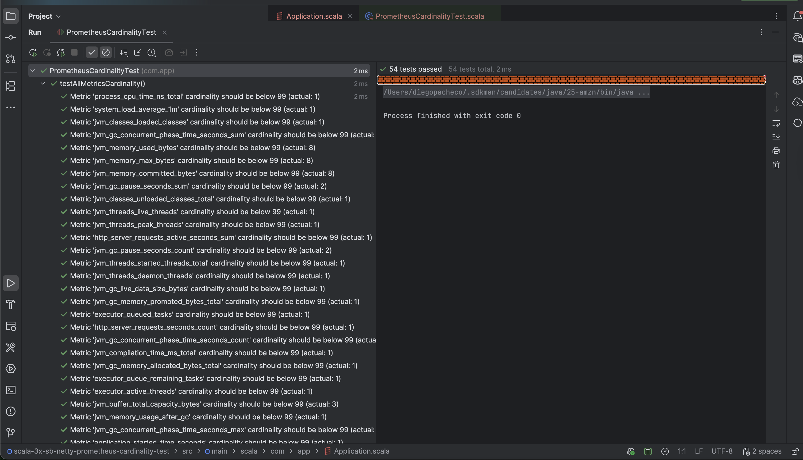
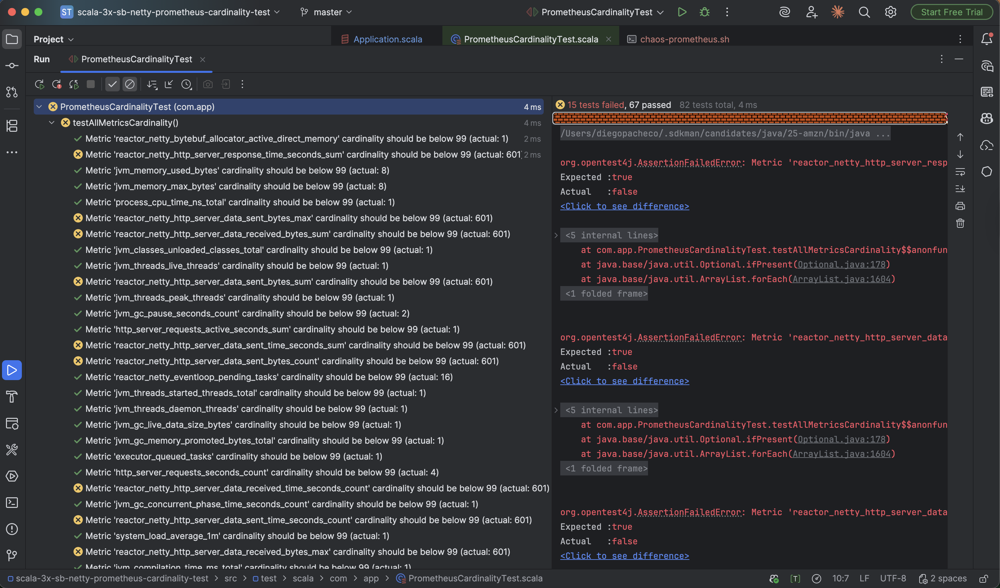

## Rationale

IF you send too many high cardinality metrics to Prometheus, it will eventually crash consuming all memory.
There is a Junit 5 dynamic tesat factory where:
1. Call Prometheus endpoint in sprint to get all metrics
2. Generate a test per mertric to check if the metric is acceptable cardinality where cardinality <= threshold(which is 99
3. Profit - Now you can know if you will break prometheus before deploying anything.

Tests is always the answer!

### Build

```
sbt compile
```

### Run
```
sbt run
```

### Result



### All Prometheus Metrics

http://localhost:8081/prometheus
```
# HELP application_ready_time_seconds Time taken for the application to be ready to service requests
# TYPE application_ready_time_seconds gauge
application_ready_time_seconds{main_application_class="com.app.Application$package$"} 1.027
# HELP application_started_time_seconds Time taken to start the application
# TYPE application_started_time_seconds gauge
application_started_time_seconds{main_application_class="com.app.Application$package$"} 1.025
# HELP disk_free_bytes Usable space for path
# TYPE disk_free_bytes gauge
disk_free_bytes{path="/Users/diegopacheco/git/diegopacheco/scala-playground/scala-3x-sb-netty-prometheus-cardinality-test/."} 3.45157658624E12
# HELP disk_total_bytes Total space for path
# TYPE disk_total_bytes gauge
disk_total_bytes{path="/Users/diegopacheco/git/diegopacheco/scala-playground/scala-3x-sb-netty-prometheus-cardinality-test/."} 3.99632932864E12
# HELP executor_active_threads The approximate number of threads that are actively executing tasks
# TYPE executor_active_threads gauge
executor_active_threads{name="applicationTaskExecutor"} 0.0
# HELP executor_completed_tasks_total The approximate total number of tasks that have completed execution
# TYPE executor_completed_tasks_total counter
executor_completed_tasks_total{name="applicationTaskExecutor"} 0.0
# HELP executor_pool_core_threads The core number of threads for the pool
# TYPE executor_pool_core_threads gauge
executor_pool_core_threads{name="applicationTaskExecutor"} 8.0
# HELP executor_pool_max_threads The maximum allowed number of threads in the pool
# TYPE executor_pool_max_threads gauge
executor_pool_max_threads{name="applicationTaskExecutor"} 2.147483647E9
# HELP executor_pool_size_threads The current number of threads in the pool
# TYPE executor_pool_size_threads gauge
executor_pool_size_threads{name="applicationTaskExecutor"} 0.0
# HELP executor_queue_remaining_tasks The number of additional elements that this queue can ideally accept without blocking
# TYPE executor_queue_remaining_tasks gauge
executor_queue_remaining_tasks{name="applicationTaskExecutor"} 2.147483647E9
# HELP executor_queued_tasks The approximate number of tasks that are queued for execution
# TYPE executor_queued_tasks gauge
executor_queued_tasks{name="applicationTaskExecutor"} 0.0
# HELP http_server_requests_active_seconds  
# TYPE http_server_requests_active_seconds summary
http_server_requests_active_seconds_count{exception="none",method="GET",outcome="SUCCESS",status="200",uri="UNKNOWN"} 1
http_server_requests_active_seconds_sum{exception="none",method="GET",outcome="SUCCESS",status="200",uri="UNKNOWN"} 0.02786875
# HELP http_server_requests_active_seconds_max  
# TYPE http_server_requests_active_seconds_max gauge
http_server_requests_active_seconds_max{exception="none",method="GET",outcome="SUCCESS",status="200",uri="UNKNOWN"} 0.028053584
# HELP jvm_info JVM version info
# TYPE jvm_info gauge
jvm_info{runtime="OpenJDK Runtime Environment",vendor="Amazon.com Inc.",version="25+36-LTS"} 1
# HELP jvm_buffer_count_buffers An estimate of the number of buffers in the pool
# TYPE jvm_buffer_count_buffers gauge
jvm_buffer_count_buffers{id="direct"} 4.0
jvm_buffer_count_buffers{id="mapped"} 0.0
jvm_buffer_count_buffers{id="mapped - 'non-volatile memory'"} 0.0
# HELP jvm_buffer_memory_used_bytes An estimate of the memory that the Java virtual machine is using for this buffer pool
# TYPE jvm_buffer_memory_used_bytes gauge
jvm_buffer_memory_used_bytes{id="direct"} 4194312.0
jvm_buffer_memory_used_bytes{id="mapped"} 0.0
jvm_buffer_memory_used_bytes{id="mapped - 'non-volatile memory'"} 0.0
# HELP jvm_buffer_total_capacity_bytes An estimate of the total capacity of the buffers in this pool
# TYPE jvm_buffer_total_capacity_bytes gauge
jvm_buffer_total_capacity_bytes{id="direct"} 4194311.0
jvm_buffer_total_capacity_bytes{id="mapped"} 0.0
jvm_buffer_total_capacity_bytes{id="mapped - 'non-volatile memory'"} 0.0
# HELP jvm_classes_loaded_classes The number of classes that are currently loaded in the Java virtual machine
# TYPE jvm_classes_loaded_classes gauge
jvm_classes_loaded_classes 8871.0
# HELP jvm_classes_unloaded_classes_total The number of classes unloaded in the Java virtual machine
# TYPE jvm_classes_unloaded_classes_total counter
jvm_classes_unloaded_classes_total 0.0
# HELP jvm_compilation_time_ms_total The approximate accumulated elapsed time spent in compilation
# TYPE jvm_compilation_time_ms_total counter
jvm_compilation_time_ms_total{compiler="HotSpot 64-Bit Tiered Compilers"} 3169.0
# HELP jvm_gc_concurrent_phase_time_seconds Time spent in concurrent phase
# TYPE jvm_gc_concurrent_phase_time_seconds summary
jvm_gc_concurrent_phase_time_seconds_count{action="end of concurrent GC pause",cause="No GC",gc="G1 Concurrent GC"} 4
jvm_gc_concurrent_phase_time_seconds_sum{action="end of concurrent GC pause",cause="No GC",gc="G1 Concurrent GC"} 0.002
# HELP jvm_gc_concurrent_phase_time_seconds_max Time spent in concurrent phase
# TYPE jvm_gc_concurrent_phase_time_seconds_max gauge
jvm_gc_concurrent_phase_time_seconds_max{action="end of concurrent GC pause",cause="No GC",gc="G1 Concurrent GC"} 0.001
# HELP jvm_gc_live_data_size_bytes Size of long-lived heap memory pool after reclamation
# TYPE jvm_gc_live_data_size_bytes gauge
jvm_gc_live_data_size_bytes 0.0
# HELP jvm_gc_max_data_size_bytes Max size of long-lived heap memory pool
# TYPE jvm_gc_max_data_size_bytes gauge
jvm_gc_max_data_size_bytes 3.2178700288E10
# HELP jvm_gc_memory_allocated_bytes_total Incremented for an increase in the size of the (young) heap memory pool after one GC to before the next
# TYPE jvm_gc_memory_allocated_bytes_total counter
jvm_gc_memory_allocated_bytes_total 1.84549376E8
# HELP jvm_gc_memory_promoted_bytes_total Count of positive increases in the size of the old generation memory pool before GC to after GC
# TYPE jvm_gc_memory_promoted_bytes_total counter
jvm_gc_memory_promoted_bytes_total 2.0533632E7
# HELP jvm_gc_overhead An approximation of the percent of CPU time used by GC activities over the last lookback period or since monitoring began, whichever is shorter, in the range [0..1]
# TYPE jvm_gc_overhead gauge
jvm_gc_overhead 0.002379553149104899
# HELP jvm_gc_pause_seconds Time spent in GC pause
# TYPE jvm_gc_pause_seconds summary
jvm_gc_pause_seconds_count{action="end of minor GC",cause="G1 Evacuation Pause",gc="G1 Young Generation"} 3
jvm_gc_pause_seconds_sum{action="end of minor GC",cause="G1 Evacuation Pause",gc="G1 Young Generation"} 0.014
jvm_gc_pause_seconds_count{action="end of minor GC",cause="Metadata GC Threshold",gc="G1 Young Generation"} 2
jvm_gc_pause_seconds_sum{action="end of minor GC",cause="Metadata GC Threshold",gc="G1 Young Generation"} 0.004
# HELP jvm_gc_pause_seconds_max Time spent in GC pause
# TYPE jvm_gc_pause_seconds_max gauge
jvm_gc_pause_seconds_max{action="end of minor GC",cause="G1 Evacuation Pause",gc="G1 Young Generation"} 0.005
jvm_gc_pause_seconds_max{action="end of minor GC",cause="Metadata GC Threshold",gc="G1 Young Generation"} 0.002
# HELP jvm_memory_committed_bytes The amount of memory in bytes that is committed for the Java virtual machine to use
# TYPE jvm_memory_committed_bytes gauge
jvm_memory_committed_bytes{area="heap",id="G1 Eden Space"} 5.0331648E7
jvm_memory_committed_bytes{area="heap",id="G1 Old Gen"} 5.0331648E7
jvm_memory_committed_bytes{area="heap",id="G1 Survivor Space"} 1.6777216E7
jvm_memory_committed_bytes{area="nonheap",id="CodeHeap 'non-nmethods'"} 3342336.0
jvm_memory_committed_bytes{area="nonheap",id="CodeHeap 'non-profiled nmethods'"} 2555904.0
jvm_memory_committed_bytes{area="nonheap",id="CodeHeap 'profiled nmethods'"} 8781824.0
jvm_memory_committed_bytes{area="nonheap",id="Compressed Class Space"} 5767168.0
jvm_memory_committed_bytes{area="nonheap",id="Metaspace"} 4.0042496E7
# HELP jvm_memory_max_bytes The maximum amount of memory in bytes that can be used for memory management
# TYPE jvm_memory_max_bytes gauge
jvm_memory_max_bytes{area="heap",id="G1 Eden Space"} -1.0
jvm_memory_max_bytes{area="heap",id="G1 Old Gen"} 3.2178700288E10
jvm_memory_max_bytes{area="heap",id="G1 Survivor Space"} -1.0
jvm_memory_max_bytes{area="nonheap",id="CodeHeap 'non-nmethods'"} 7602176.0
jvm_memory_max_bytes{area="nonheap",id="CodeHeap 'non-profiled nmethods'"} 1.22044416E8
jvm_memory_max_bytes{area="nonheap",id="CodeHeap 'profiled nmethods'"} 1.22011648E8
jvm_memory_max_bytes{area="nonheap",id="Compressed Class Space"} 1.073741824E9
jvm_memory_max_bytes{area="nonheap",id="Metaspace"} -1.0
# HELP jvm_memory_usage_after_gc The percentage of long-lived heap pool used after the last GC event, in the range [0..1]
# TYPE jvm_memory_usage_after_gc gauge
jvm_memory_usage_after_gc{area="heap",pool="long-lived"} 3.556591129402423E-4
# HELP jvm_memory_used_bytes The amount of used memory
# TYPE jvm_memory_used_bytes gauge
jvm_memory_used_bytes{area="heap",id="G1 Eden Space"} 0.0
jvm_memory_used_bytes{area="heap",id="G1 Old Gen"} 1.1444648E7
jvm_memory_used_bytes{area="heap",id="G1 Survivor Space"} 6269464.0
jvm_memory_used_bytes{area="nonheap",id="CodeHeap 'non-nmethods'"} 2048576.0
jvm_memory_used_bytes{area="nonheap",id="CodeHeap 'non-profiled nmethods'"} 1521728.0
jvm_memory_used_bytes{area="nonheap",id="CodeHeap 'profiled nmethods'"} 7969664.0
jvm_memory_used_bytes{area="nonheap",id="Compressed Class Space"} 5574256.0
jvm_memory_used_bytes{area="nonheap",id="Metaspace"} 3.9500864E7
# HELP jvm_threads_daemon_threads The current number of live daemon threads
# TYPE jvm_threads_daemon_threads gauge
jvm_threads_daemon_threads 10.0
# HELP jvm_threads_live_threads The current number of live threads including both daemon and non-daemon threads
# TYPE jvm_threads_live_threads gauge
jvm_threads_live_threads 12.0
# HELP jvm_threads_peak_threads The peak live thread count since the Java virtual machine started or peak was reset
# TYPE jvm_threads_peak_threads gauge
jvm_threads_peak_threads 12.0
# HELP jvm_threads_started_threads_total The total number of application threads started in the JVM
# TYPE jvm_threads_started_threads_total counter
jvm_threads_started_threads_total 15.0
# HELP jvm_threads_states_threads The current number of threads
# TYPE jvm_threads_states_threads gauge
jvm_threads_states_threads{state="blocked"} 0.0
jvm_threads_states_threads{state="new"} 0.0
jvm_threads_states_threads{state="runnable"} 8.0
jvm_threads_states_threads{state="terminated"} 0.0
jvm_threads_states_threads{state="timed-waiting"} 2.0
jvm_threads_states_threads{state="waiting"} 2.0
# HELP logback_events_total Number of log events that were enabled by the effective log level
# TYPE logback_events_total counter
logback_events_total{level="debug"} 0.0
logback_events_total{level="error"} 0.0
logback_events_total{level="info"} 2.0
logback_events_total{level="trace"} 0.0
logback_events_total{level="warn"} 0.0
# HELP process_cpu_time_ns_total The "cpu time" used by the Java Virtual Machine process
# TYPE process_cpu_time_ns_total counter
process_cpu_time_ns_total 4.934422E9
# HELP process_cpu_usage The "recent cpu usage" for the Java Virtual Machine process
# TYPE process_cpu_usage gauge
process_cpu_usage 0.0
# HELP process_files_max_files The maximum file descriptor count
# TYPE process_files_max_files gauge
process_files_max_files 1048576.0
# HELP process_files_open_files The open file descriptor count
# TYPE process_files_open_files gauge
process_files_open_files 131.0
# HELP process_start_time_seconds Start time of the process since unix epoch.
# TYPE process_start_time_seconds gauge
process_start_time_seconds 1.763711926629E9
# HELP process_uptime_seconds The uptime of the Java virtual machine
# TYPE process_uptime_seconds gauge
process_uptime_seconds 5.538
# HELP reactor_netty_bytebuf_allocator_active_direct_memory  
# TYPE reactor_netty_bytebuf_allocator_active_direct_memory gauge
reactor_netty_bytebuf_allocator_active_direct_memory{id="580914454",type="pooled"} 0.0
# HELP reactor_netty_bytebuf_allocator_active_heap_memory  
# TYPE reactor_netty_bytebuf_allocator_active_heap_memory gauge
reactor_netty_bytebuf_allocator_active_heap_memory{id="580914454",type="pooled"} 0.0
# HELP reactor_netty_bytebuf_allocator_chunk_size  
# TYPE reactor_netty_bytebuf_allocator_chunk_size gauge
reactor_netty_bytebuf_allocator_chunk_size{id="580914454",type="pooled"} 4194304.0
# HELP reactor_netty_bytebuf_allocator_direct_arenas  
# TYPE reactor_netty_bytebuf_allocator_direct_arenas gauge
reactor_netty_bytebuf_allocator_direct_arenas{id="580914454",type="pooled"} 32.0
# HELP reactor_netty_bytebuf_allocator_heap_arenas  
# TYPE reactor_netty_bytebuf_allocator_heap_arenas gauge
reactor_netty_bytebuf_allocator_heap_arenas{id="580914454",type="pooled"} 32.0
# HELP reactor_netty_bytebuf_allocator_normal_cache_size  
# TYPE reactor_netty_bytebuf_allocator_normal_cache_size gauge
reactor_netty_bytebuf_allocator_normal_cache_size{id="580914454",type="pooled"} 64.0
# HELP reactor_netty_bytebuf_allocator_small_cache_size  
# TYPE reactor_netty_bytebuf_allocator_small_cache_size gauge
reactor_netty_bytebuf_allocator_small_cache_size{id="580914454",type="pooled"} 256.0
# HELP reactor_netty_bytebuf_allocator_threadlocal_caches  
# TYPE reactor_netty_bytebuf_allocator_threadlocal_caches gauge
reactor_netty_bytebuf_allocator_threadlocal_caches{id="580914454",type="pooled"} 1.0
# HELP reactor_netty_bytebuf_allocator_used_direct_memory  
# TYPE reactor_netty_bytebuf_allocator_used_direct_memory gauge
reactor_netty_bytebuf_allocator_used_direct_memory{id="580914454",type="pooled"} 4194304.0
# HELP reactor_netty_bytebuf_allocator_used_heap_memory  
# TYPE reactor_netty_bytebuf_allocator_used_heap_memory gauge
reactor_netty_bytebuf_allocator_used_heap_memory{id="580914454",type="pooled"} 0.0
# HELP reactor_netty_eventloop_pending_tasks  
# TYPE reactor_netty_eventloop_pending_tasks gauge
reactor_netty_eventloop_pending_tasks{name="reactor-http-nio-2"} 0.0
reactor_netty_eventloop_pending_tasks{name="reactor-http-nio-3"} 0.0
# HELP reactor_netty_http_server_connections  
# TYPE reactor_netty_http_server_connections gauge
reactor_netty_http_server_connections{local_address="0:0:0:0:0:0:0:1:8081",uri="http"} 2.0
# HELP reactor_netty_http_server_connections_active  
# TYPE reactor_netty_http_server_connections_active gauge
reactor_netty_http_server_connections_active{local_address="0:0:0:0:0:0:0:1:8081",uri="http"} 1.0
# HELP reactor_netty_http_server_data_received_time_seconds  
# TYPE reactor_netty_http_server_data_received_time_seconds summary
reactor_netty_http_server_data_received_time_seconds_count{method="GET",uri="/prometheus"} 1
reactor_netty_http_server_data_received_time_seconds_sum{method="GET",uri="/prometheus"} 0.033637625
# HELP reactor_netty_http_server_data_received_time_seconds_max  
# TYPE reactor_netty_http_server_data_received_time_seconds_max gauge
reactor_netty_http_server_data_received_time_seconds_max{method="GET",uri="/prometheus"} 0.033637625
# HELP system_cpu_count The number of processors available to the Java virtual machine
# TYPE system_cpu_count gauge
system_cpu_count 16.0
# HELP system_cpu_usage The "recent cpu usage" of the system the application is running in
# TYPE system_cpu_usage gauge
system_cpu_usage 0.0
# HELP system_load_average_1m The sum of the number of runnable entities queued to available processors and the number of runnable entities running on the available processors averaged over a period of time
# TYPE system_load_average_1m gauge
system_load_average_1m 3.32470703125
```

## Run Chaos 

Terminal 1
```
./run.sh
```

Terminal 2
```
./run-chaos.sh
```
```
❯ ./chaos-prometheus.sh
Starting chaos test - generating 200 unique requests per endpoint...
Completed 20 requests per endpoint...
Completed 40 requests per endpoint...
Completed 60 requests per endpoint...
Completed 80 requests per endpoint...
Completed 100 requests per endpoint...
Completed 120 requests per endpoint...
Completed 140 requests per endpoint...
Completed 160 requests per endpoint...
Completed 180 requests per endpoint...
Completed 200 requests per endpoint...
Chaos test completed! Generated 600 total unique requests (200 per endpoint)
Check metrics at: http://localhost:8081/prometheus
```



Now several metrics blow up to the roof like (15/82 metrics/tests fail):
* reactor_netty_http_server_data_received_time_seconds_max (601)
* reactor_netty_http_server_data_sent_time_seconds_sum (601)
* reactor_netty_http_server_data_received_time_seconds_sum (601)
* reactor_netty_http_server_data_sent_bytes_count (601)
* reactor_netty_http_server_response_time_seconds_sum (601)
* reactor_netty_http_server_response_time_seconds_max (601)
* reactor_netty_http_server_data_sent_time_seconds_max (601)
* reactor_netty_http_server_data_received_bytes_count (601)
* reactor_netty_http_server_response_time_seconds_count (601
* reactor_netty_http_server_data_received_time_seconds_max (601)
* reactor_netty_http_server_data_received_bytes_max (601)
* reactor_netty_http_server_data_sent_time_seconds_count (601)
* reactor_netty_http_server_data_received_time_seconds_count (601)
* reactor_netty_http_server_data_sent_bytes_sum (601)

IF you dont generate some load you wont see the issue - so chaos matters !!!