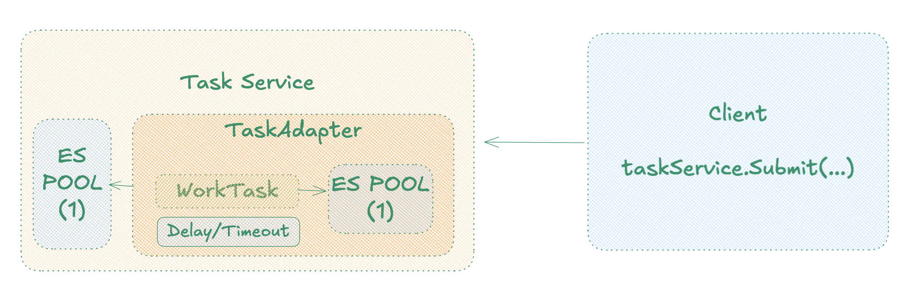

# Rationale

Here we have the adapter design pattern striking again.
The beauty of the `TaskAdapter` is that abstract common things for all business task like:
1. Delayed Execution - wait before running the task - we could add jitter here.
2. Timeout Management - when timeout happens the whole "thread is canceled".



The class `TaskService` just create important context objects and pass it to the Task Adapter.
One non-obvious thing is why - I do have 2 ExecutorServices? Well because I want to cancel the Future, 
`Await.result` does not cancel the Future when timeout happens, so I need a separate 
ExecutorService to run the task that can be canceled. Why not use just 1 ExecutorService with many threads?
That create some disastrous scenarios where all threads are busy waiting for timeout tasks to finish
and no thread is available to run the actual tasks. That's why we need 2.

They second ES is not being terminated so is fine, there is reuse.

### Build

```
sbt compile
```

### Run
```
sbt run
```

### Result

```
/Users/diegopacheco/.sdkman/candidates/java/17.0.16-amzn/bin/java -javaagent:/Applications/IntelliJ IDEA.app/Contents/lib/idea_rt.jar=52649 -Dfile.encoding=UTF-8 -classpath /Users/diegopacheco/git/diegopacheco/scala-playground/scala-3x-submission-wrapper-internal-queue/target/scala-3.7.2/classes:/Users/diegopacheco/Library/Caches/Coursier/v1/https/repo1.maven.org/maven2/org/scala-lang/scala3-library_3/3.7.2/scala3-library_3-3.7.2.jar:/Users/diegopacheco/Library/Caches/Coursier/v1/https/repo1.maven.org/maven2/org/scala-lang/scala-library/2.13.16/scala-library-2.13.16.jar main
Task ID 1 submitted.
>> Running on TaskAdapter for task(1) in 2s will timeout...
Task ID 2 submitted.
Task ID 3 submitted.
>> Waiting 1s for task(1) before running
1. Hello from WorkTask!
>> Running on TaskAdapter for task(2) in 2s will timeout...
>> Waiting 1s for task(2) before running
2. does not gonna go well...
Task timed out - for task(2)
>> Running on TaskAdapter for task(3) in 2s will timeout...
>> Waiting 1s for task(3) before running
3. Hello from WorkTask again!
```


